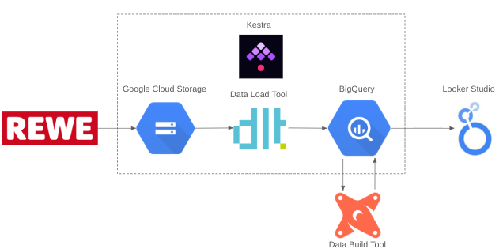
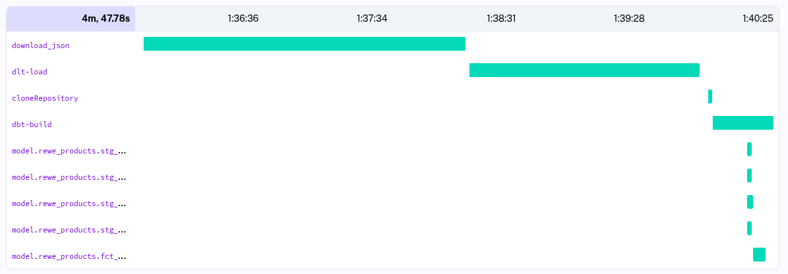
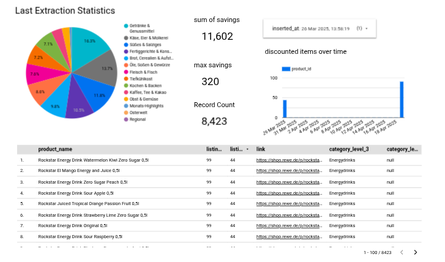

# Rewe_Products

### Objective

The goal of this project is to apply everything we have learned
in the [Data-Engineering-Zoomcamp-2025](https://github.com/DataTalksClub/data-engineering-zoomcamp) course to build an end-to-end data pipeline. I have chosen the Rewe Shop API ([Example API Call](https://shop.rewe.de/api/products?objectsPerPage=250&page=1&search=%2A&sorting=RELEVANCE_DESC&serviceTypes=DELIVERY&market=240557&debug=false&autocorrect=true)) as dataset to process and analyze. This dataset includes grocery products with corresponding attributes like name, price, discount etc. that one can buy online from the [Rewe portal](https://shop.rewe.de/). However, accessing and processing this data in a structured manner can be a challenging task, especially when trying to analyze it over different time periods or extract meaningful statistics from it.

### Problem statement

* Creating a pipeline for processing this dataset and putting it to a datalake
* Creating a pipeline for moving the data from the lake to a data warehouse
* Transforming the data in the data warehouse: prepare it for the dashboard
* Building a dashboard to visualize the data

## Data Pipeline 

The pipeline could be **stream** or **batch**. I have chosen a Batch data pipeline to run things periodically (e.g. daily)

## Technologies 

* **Cloud**: GCP
* **Infrastructure as code (IaC)**: None
* **Workflow orchestration**: [Kestra](https://kestra.io/)
* **Data Warehouse**: BigQuery
* **Dashboard**: Google Data Studio / Looker

### Kestra
Our kestra flow includes 4 stages:
1. **download_json**: This stage downloads all the available json files from the Rewe API and stores them in our Data Lake (Google Cloud Storage). For accessing the data we need to somehow use [Playwright](https://playwright.dev/) to imitate a real browser. Each page includes 250 products and we need about 40 requests to download products from one store. Currently the store / marketid is hardcoded to Berlin-Lichtenrade, but this could be changed in a future version.
2. **dlt_load**: This stage uses [dlt](https://dlthub.com/) loads all the json files from GCS, performs unnesting and loads the data into BigQuery. This results in 3 internal dlt tables and 6 Rewe specific tables being created. See [image](images/BigQuery_tables.png).
3. **cloneRepository**: This stage clones the github repository in order to use [dbt](https://www.getdbt.com/) in the next stage.
4. **dbt-build**: This stage builds our dbt project including 4 staging tables/views and 1 materialized fact table. The Lineage looks like [that](images/dbt_lineage.png).

### Sample Data from fact table

| product_id | product_name               | category_path                                          | category_level_1            | category_level_2 | category_level_3  | category_level_4 | link                                                               | brand      | listing_price | listing_regular_price | listing_discount_rate | listing_discount_valid_to   | listing_grammage       | extracted_grammage | image_link                                                          | inserted_at                      |
|------------|---------------------------|------------------------------------------------------|-----------------------------|------------------|-------------------|------------------|--------------------------------------------------------------------|-----------|---------------|----------------------|----------------------|--------------------------|-----------------------|-----------------|--------------------------------------------------------------------|----------------------------------|
| 8757465    | Milka Choco Brookie 132g   | Brot, Cerealien & Aufstriche/Backwaren/Süße Backwaren/Brownies/ | Brot, Cerealien & Aufstriche | Backwaren        | Süße Backwaren    | Brownies         | [Link](https://shop.rewe.de/p/milka-choco-brookie-132g/8757465)   | Milka     | 219           | 289                  | 24.0                 | 2025-04-19 22:00:00 UTC  | 132g (1 kg = 16,59 €)  | 132g            |  | 2025-03-27 20:37:46.715219 UTC  |
| 3042168    | Milka Choco Brownie 6x25g  | Brot, Cerealien & Aufstriche/Backwaren/Süße Backwaren/Brownies/ | Brot, Cerealien & Aufstriche | Backwaren        | Süße Backwaren    | Brownies         | [Link](https://shop.rewe.de/p/milka-choco-brownie-6x25g/3042168)  | Milka     | 219           | 289                  | 24.0                 | 2025-04-19 22:00:00 UTC  | 150g (1 kg = 14,60 €)  | 150g            |  | 2025-03-26 13:58:19.921985 UTC  |
| 8925486    | Mövenpick Brownie 300g     | Brot, Cerealien & Aufstriche/Backwaren/Süße Backwaren/Brownies/ | Brot, Cerealien & Aufstriche | Backwaren        | Süße Backwaren    | Brownies         | [Link](https://shop.rewe.de/p/moevenpick-brownie-300g/8925486)    | Mövenpick | 339           | null                 | null                 | null                     | 300g (1 kg = 11,30 €)  | 300g            |  | 2025-03-29 12:40:45.662115 UTC  |

### Dashboard
Dashboard link: https://lookerstudio.google.com/reporting/8faef706-3516-4be4-82b7-587bdc9eacb4
- The pie chart on the top left shows the distribution of the top product categories from Rewe.
- The bar chart on the top right shows the amount of products according to their attribute discount_valid_to.
- In the top center you can see some KPIs like number of products, max potential saving and sum of savings if all products would be purchased.
- On the bottom you can see a table of the discounted products ordered by discount.

### Reproducibility
In order to deploy the pipeline yourself you need to follow the following steps:
1. Clone the github repo.
2. Create GCP Storage Bucket and Service account with Storage Admin rights and BigQuery Database access rights.
3. Deploy kestra: Navigate to `\kestra` and execute `docker-compose up -d`.
4. Upload the kestra flow and python scripts into the flows namespace.
5. Upload the Service Account JSON with your Google Credentials. The filename should be the same as `splendid-parsec-449218-j6-6de2b711f9d0.json`.
6. Run the flow `rewe-flow`.
