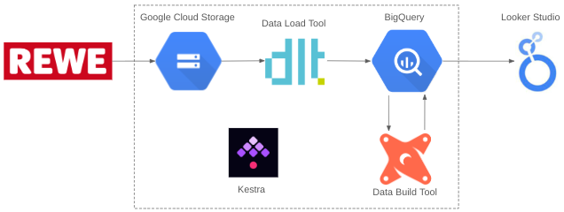

# rewe_products

### Objective

The goal of this project is to apply everything we have learned
in the [Data-Engineering-Zoomcamp-2025](https://github.com/DataTalksClub/data-engineering-zoomcamp) course to build an end-to-end data pipeline.

### Problem statement

* Selecting a dataset of interest
* Creating a pipeline for processing this dataset and putting it to a datalake
* Creating a pipeline for moving the data from the lake to a data warehouse
* Transforming the data in the data warehouse: prepare it for the dashboard
* Building a dashboard to visualize the data

## Data Pipeline 

The pipeline could be **stream** or **batch**. I have chosen a Batch data pipeline to run things periodically (e.g. daily)

## Technologies 

* **Cloud**: GCP
* **Infrastructure as code (IaC)**: None
* **Workflow orchestration**: Kestra
* **Data Warehouse**: BigQuery
* **Batch processing**: None
* **Dashboard**: Google Data Studio / Looker

### kestra

### DLT (Data Load Tool)
The ELT pipeline is establisehd with dlt.

### DBT (Data Build tool)
I have chosen dbt.

The Lineage looks like that:

## Dashboard

- 1 graph that shows the distribution of some categorical data 
- 1 graph that shows the distribution of the data across a temporal line